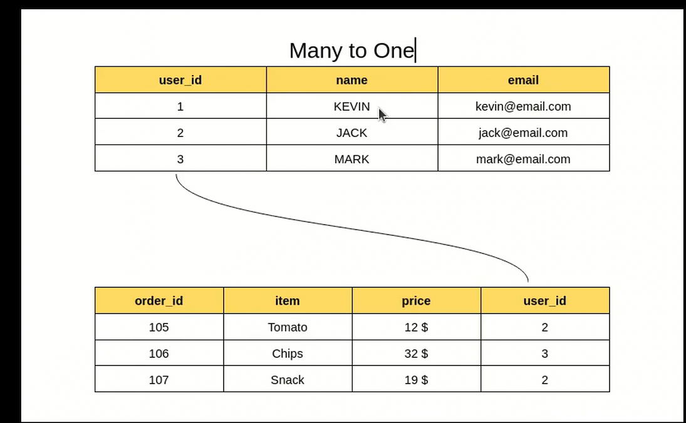
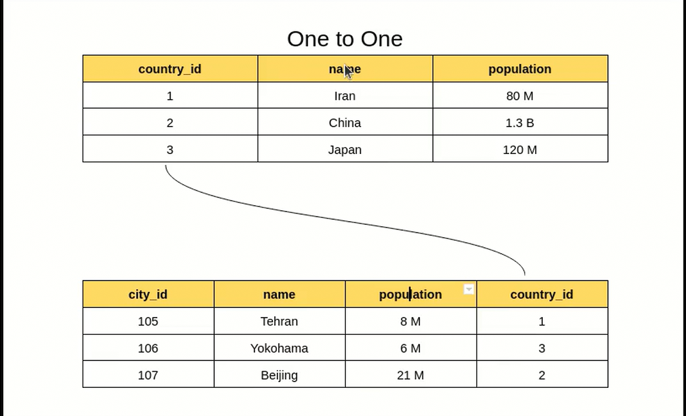
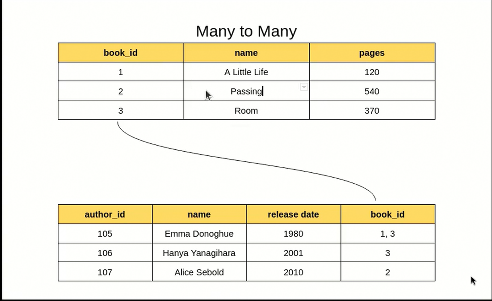
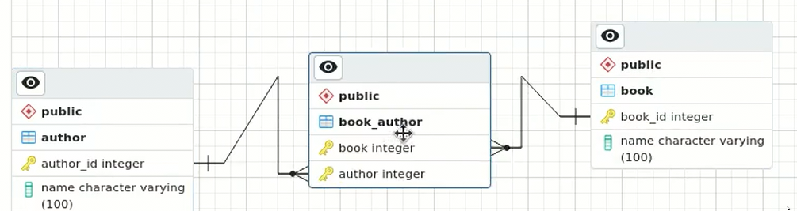
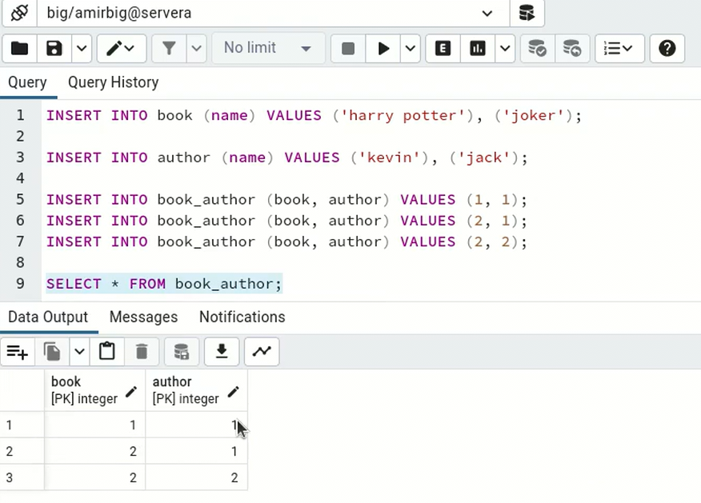

# databases()
sql and No-sql
DBMS( database management system) ==>postgresql , mongoose,SQLITE(file),mySQL,Oracel
# POSTGRESQL
## psql
psql is a terminal-based front-end to POSTGRESQL ,comand-line interface to POSTGRESQL
CRUD()==> CREATE,READ,Update,DELETE

## NOSQL
key-value,GRAPH,Document,column-family(casendra)
without good structure
## 🌟SQL(structured query language)🌟
SQL stands for Structured Query Language. It is a standard programming language used to interact with relational databases. SQL is used for querying, manipulating, 
and managing data stored in relational database management systems (RDBMS).
* Table: A table has a combination of rows and columns. 
* Rows are called records and columns are called fields
## TABLE(TYPE:https://www.postgresql.org/docs/current/datatype.html)
* SERIAL TYPE are those type that insert auto.
* CREATE TABLE name(email VARCHAR<variable charecter>(60),password VARCHAR(25), age smallint,address VARCHAR(2000));
* ALTER TABLE name ADD COLUMN lastname VARCHAR(410) UNIQUE;
1) Attribute ==> ID,AGE,NAME
2) Tuples(Entities) ==> {name:"afshin",age:900}


### Key SQL Concepts to Master
### Basic SQL Commands:
SELECT: Retrieve data from a database,INSERT: Add new rows into a table,UPDATE: Modify existing data in a table.DELETE: Remove data from a table
WHERE name IN("afshin","sara,"amir") 
ORDER BY (ASC<A,B,C>ASNDEING,DESC<z,y,z>DESENDEING)
WHERE username LIKE 'A_f%'==>_ sure exist more than 2 world,% each empty or full.
LIMIT 30
```
SELECT * FROM users;
INSERT INTO users (name, email) VALUES ('afshin', 'afi@example.com');
UPDATE users SET email = 'afi.doe@example.com' WHERE name = 'afshin';
DELETE FROM users WHERE name = 'afshin';

```

###  Joins
Combining rows from two or more tables based on a related column.
INNER JOIN: Returns only matching records.
LEFT JOIN (LEFT OUTER JOIN): Returns all records from the left table and matched records from the right table.
RIGHT JOIN (RIGHT OUTER JOIN): Similar to LEFT JOIN, but returns all records from the right table.
FULL JOIN: Returns all records when there is a match in either left or right table
   
### GROUP BY & Aggregation Functions
GROUP BY & Aggregation Functions
GROUP BY is used to group rows that have the same values into summary rows.
Common aggregation use for calculations functions include COUNT(), SUM(), AVG(), MAX(), and MIN().
HAVING we can define some order like if ,HAVING age > 120
   
### Subqueries
A subquery is a query within another query. It can be used in the SELECT, FROM, WHERE, and HAVING clauses.
    ```
    SELECT name FROM employees WHERE department_id = (SELECT department_id FROM departments WHERE department_name = 'IT');
    
    ```
   
### Indexes
* Indexes improve query performance by allowing the database to locate rows faster without scanning the entire table.
* Indexes speed up retrieval of records but can slow down data modification operations (like INSERT, UPDATE, and DELETE).defualt on Primary key
Primary Key: Uniquely identifies each record.
Foreign Key: Ensures referential integrity between tables.
 
### primary key = those Validator are unique that can delete or update like PRODUCT_ID ,user_ID
primary key == UNIQUE ,NOT NULL
    ```
        USER_ID SERIAL PRIMARY KEY
    ```
   
### FOREIGN KEY
A foreign key (FK) is a column or combination of columns that is used to establish and enforce a link between the data in two 
tables to control the data that can be stored in the foreign key table.
    ```
        CREATE TABLE users(ID PRIMARY KEY)
        CREATE TABLE orders(user_id integert REFRENCES users(ID))
    ```
  
### Normalization and Denormalization
* ANOMALY == problem
Normalization Normalization is a process in database design that aims to reduce data redundancy (repetition) and avoid data anomalies (inconsistencies) during data insertion, updating, or deletion.
It involves organizing data into tables in a way that eliminates undesirable dependencies and ensures efficient storage.
*** we have 11 type normal design <WIKI> but 7 of them is most necessary
   1) FIRST NORMAL FORM (1NF)
      if you have relation database so you should behaving with relation
      • Each column must have a unique name.
      • The order of the row and column doesn't matter.
      • Each column must have a single data type.
      • No Two rows can contain identical Value.<repeate>
      • each column must contain a single Value.
      • Columns cannot contain repeating groups.
   2) SECOND NORMAL FORM (2NF)
      • all thin in First Norma Form 
      • All of the non-key fields depend on all of the key fields <Donot insert> mean all of the key should refer to the table
   match table<wrong> ==> time,wrestler,class,rank ==> we should seprate the table time or class and not conde in one
   and it is good for stop this wrong ==> insert and update and delete Anomaly.

   3) THIRD NORMAL FORM (3NF)
      • all in 2
      • each column has self information
   wrong if delete one user we do not delete the product that his order
   4) Boyce-Codd Normal Form (BCNF):
      A stricter version of 3NF. Each determinant (attribute determining another) must be a candidate key.
   5) FOURTH NORMAL FORM (4NF)
### Denormalization
we delete extra value or we merge to coulmn till we less the cost of the joins
### Transactions
those unit of work (واحدی از عملیات) on Database like transform Money.
* Start ----> Operation1,Operation2,Operation3,.... ---> Commit OR RoleBack
## 1) ACID ,
* A----> Atomicity (all Operation should be successful if one of them got fall all of them should destroy)lost money from a but not incress on b
* C----> Consistency (do all role) like the price not -,or if we have 3 server and to each service we come and change and we sure it update to all server
* I----> ISOLATION(all Operation focuse on self not an other)
* D----> Durability(if the system crash and we should maintain the stated like implement the log)
2) COMMIT:Finalizes a transaction <run the all operation>,
3) ROLLBACK: Reverts a transaction.
```
   BEGIN TRANSACTION;
   UPDATE accounts SET balance = balance - 100 WHERE account_id = 1;
   UPDATE accounts SET balance = balance + 100 WHERE account_id = 2;
   COMMIT;
```
### Views
A view is a virtual table based on the result of a query. It simplifies complex queries and can improve security by limiting direct access to underlying tables.
virtual tables created using a SELECT statement.

# replication <Replica>
* you get a copy of from anything in kafka queue or in db a database now you can define some role for example this just handle write and read or this just update or one day destory the db it handle.
# Sharding
* you seprate your database to part part : for example you have online shop and you have two country iran and canada to you seprate table with country.
* it is kind of partition.
* They divide the database into smaller, more convenient pieces called shards.
* They divide the database into smaller, more convenient pieces called shards.
# operators available in SQL.
## Arithmetic Operators
* +	Addition	SELECT 5 + 3;
* -	Subtraction	SELECT 5 - 3;
* *	Multiplication	SELECT 5 * 3;
* /	Division	SELECT 10 / 2;
* %	Modulus (remainder)	SELECT 10 % 3;
## Comparison Operators
* =	Equal to	SELECT * FROM users WHERE age = 30;
* != or <>	Not equal to	SELECT * FROM users WHERE age != 30;
* >	Greater than	SELECT * FROM users WHERE age > 30;
* <	Less than	SELECT * FROM users WHERE age < 30;
* >=	Greater than or equal to	SELECT * FROM users WHERE age >= 30;
* <=	Less than or equal to	SELECT * FROM users WHERE age <= 30;

## Logical Operators
* AND	Returns TRUE if both conditions are true	SELECT * FROM users WHERE age > 30 AND city = 'New York';
* OR	Returns TRUE if at least one condition is true	SELECT * FROM users WHERE age > 30 OR city = 'New York';
* NOT	Negates a condition	SELECT * FROM users WHERE NOT age > 30;
## Bitwise Operators
* >> &	Bitwise AND	SELECT 5 & 3;
* >> `	`	Bitwise OR
* >> ^	Bitwise XOR	SELECT 5 ^ 3;
* >> ~	Bitwise NOT	SELECT ~5;
* >> <<	Left shift	SELECT 5 << 1;
* >> 	Right shift	SELECT 5 >> 1;
## Set Operators
* >> UNION	Combines results (removes duplicates)	SELECT name FROM employees UNION SELECT name FROM managers;
* >> UNION ALL	Combines results (keeps duplicates)	SELECT name FROM employees UNION ALL SELECT name FROM managers;
* >> INTERSECT	Returns common records between queries	SELECT name FROM employees INTERSECT SELECT name FROM managers;
* >> EXCEPT	Returns records from the first query not in the second	SELECT name FROM employees EXCEPT SELECT name FROM managers;
##  String Operators
* >> LIKE	Pattern matching	SELECT * FROM users WHERE name LIKE 'J%';
* >> ILIKE	Case-insensitive pattern matching (PostgreSQL)	SELECT * FROM users WHERE name ILIKE 'j%';
## Special Operators
* >> IN	Checks if a value is in a set	SELECT * FROM users WHERE age IN (25, 30, 35);
* >> NOT IN	Checks if a value is not in a set	SELECT * FROM users WHERE age NOT IN (25, 30, 35);
* >> BETWEEN	Checks if a value is within a range	SELECT * FROM users WHERE age BETWEEN 25 AND 35;
* >> NOT BETWEEN	Checks if a value is outside a range	SELECT * FROM users WHERE age NOT BETWEEN 25 AND 35;
* >> IS NULL	Checks for null values	SELECT * FROM users WHERE age IS NULL;
* >> IS NOT NULL	Checks for non-null values	SELECT * FROM users WHERE age IS NOT NULL;
* >> EXISTS	Checks if a subquery returns any results	SELECT * FROM users WHERE EXISTS (SELECT 1 FROM orders WHERE orders.user_id = users.id);
* >> ANY	Compares a value to any value in a set	SELECT * FROM users WHERE age > ANY (SELECT age FROM managers);
* >> ALL	Compares a value to all values in a set	SELECT * FROM users WHERE age > ALL (SELECT age FROM managers);

# Constraint
Constraints are the rules that we can apply to the type of data in a table. 
That is, we can specify the limit on the type of data that can be stored in
a particular column in a table using constraints.
Common constraints include:
* >> NOT NULL: Ensures that a column cannot have a NULL value.
* >> UNIQUE: Ensures all values in a column are unique.
* >> CHECK: Ensures values in a column meet a specific condition.
* >> DEFAULT: Sets a default value for a column if no value is provided.
* >> FOREIGN KEY: Maintains referential integrity between tables.
# RELATIONS
1) MANY TO ONE(DEFAULT)

father can relation with each child But the child just have one father
```
 afshin can buy bnana and car and mobile ==> afshin is user<father> that product that store in order that relation with user
 - for each product we create a order tabele that has one father in product afshin and not amir and afshin
```
2) ONE TO ONE

a parent just can has one child. ==> each country just has one capital.
```
IRAN = TEHRAN;
JAPAN = TOKUP;
CREATE TABLE COUNTRY (ID...)
CREATE TABLE CAPITAL(COuntri_ID integer REFENCE counrty(ID) UNIQUE)
```
3) MANY TO MANY(x,y,z that z is middleman between x,y)

   a parent can has a lot child and a child can has a lot parent writer and book,a witer has al lot book or a book has many writter
```
CREATE TABLE Book(id)
CREATE TABLE author(Id)
CREATE TABLE book_author(
bookId REF
authorId REF
PRIMARY KEY(Book,author)
)
```

```
INSERT INTO book (name) VALUES ('harry patter'),('joker');
INSERT INTO author (name) VALUES ('kevin'),('jack');
INSERT INTO book_author (book,author) VALUES(1,2)
INSERT INTO book_author  (book,author) VALUES(2,1)
INSERT INTO book_author (book,author) VALUES(2,2)
// hary patter write iust by jevin But joker write with kevin and jack
```


# JOIN
### Relation between Tables
SELECT * FROM users INNER JOIN orders ON orders.user_id= user.user_id INNER JOIN employees ON orders.em_id  = employees.em_id
SELECT USERID FROM customers RIGHT JOIN orders ON orders.customersid =
left => the table write on the left name <customers>
right ==> the table is on the right <orders>
And we have 4 type of  join:
1) INNER JOIN: command information
2) LEFT JOIN:all command information + all information table left
3) RIGHT JOIN:all command information + all information table قهلاف
4) FULL JOIN:all command information
5) CROSS JOIN:Produces the Cartesian product of two tables.
6) SELF JOIN: A table is joined with itself
# KEYS
1) Primary Key
   The primary key in SQL is a single, or a group of fields or columns that can uniquely identify a row in a table. 
    Putting it simply, it is a column that accepts unique values for each row.
2) Candidate Key <prime attributes>
   each column that has qualification to be Primary key that we say Candidate key.
   It is used to ensure that there are no duplicate or ambiguous records in a table
3) Alternate Key <non-prime attribute>
   you have 3 column that has qualification for Primary key <A,B,C> and we choice A.
   and we do not choice B and  C so we call them AlternateKey.
   Alternate keys are those candidate keys which are not the Primary key.
4) Super Key
   A Super key is a single key or a group of multiple keys that can uniquely identify tuples in a table.and you can find a 
value in table with theme forExample phonenumber or nantionalCode are unique and you can find a person with theme  phoneumber + nantionalcode == primarykey of user_id
5) Foreign Key
   A FOREIGN KEY is a field (or collection of fields) in one table, that refers to the PRIMARY KEY in another table.
6) Surrogate <saryGyt>Key that mean on own table and donot  valueable in public place.
   A surrogate key on a table is a column with a unique identifier for each row.
    The key is not generated from the table data. Data modelers like to create surrogate keys on their tables when they design data warehouse models.
   ForExample 14,25 taht mean true or fale in my businse
7) Natural key
   that all structure that has identify in real world like Ir is iran or 1,0 that mean true or false.
8) Simple Key
   a column that can be primary key alone we called it simple key like Student_Id
9) Composite Key
   that mean we have Combine any <2 or 3 or 4 ,...> colum Combine together that hapend a primary key like (firstname and Last name and age)
10) Compound Key
   that is composite key that one row is ref .like (Role and Last name and age)
11) Intelligent Key<smart>
    • do not use it
    ID =  20010816Ir1785
    Birthday ==> 2001/08/15
    Counrty = Ir
    postCode = 1785

# UNION,UNION ALL,INTERSECT,EXCEPT
that is look like join But without need primary key and foregin key.
query1+query2
1) UNION<DISTINCT ==> DELETE common value;All ==> bring all data even common>query1+query2
   all information in query One and Two with out command data.
   SELECT city from Admin;
   UNION
   SELECT city form USER;
   result is ==> match all city in admin and user in one column with out common
   if UNION ALL
   result ==> bring all data even common
2) UNION ALL
   return all information in query One and Two.
3) INTERSECT
   return just common data in query one and two.
4) Except
   return all in query one provided that that data not exist on query two.
   iran is in query two and in query one is italy and iran and return italy
# Embedded
* you have two coulmn in row 1 you have userID = 8 but in row 2 you have roomId = 12 now you can Embedded row 1(userID) row 2(roomId) it genrate a code like 4_n2
and now every where you find with 4_n2 it retrun row 1 and row 2
# Question
## What is the difference between UNIQUE and PRIMARY KEY constraints?
* PRIMARY KEY:ensures each row in a table is uniquely identifiable.
* UNIQUE:Columns with UNIQUE can have NULL values unless explicitly set to NOT NULL.
## What is the difference between DELETE, TRUNCATE, and DROP?
* DELETE: Removes rows from a table. Can use WHERE to filter.
* TRUNCATE: Removes all rows, faster than DELETE, but cannot use WHERE.
* DROP: Deletes the entire table or database.
## How would you optimize a slow SQL query?
* Analyze with EXPLAIN.
* Use proper indexing.
* Avoid SELECT *, fetch only needed columns.
* Normalize large tables.
* Use joins efficiently.
* Optimize subqueries with WITH (Common Table Expressions).

# 🌟MongoDB(Schema-less)🌟
* Answer: MongoDB is a NoSQL, document-oriented database that stores data in JSON-like BSON documents.
Unlike relational databases, it does not rely on fixed schemas or tables. It uses collections instead of 
tables and documents instead of rows. MongoDB is designed for scalability and high performance.
* MongoDB is a popular NoSQL database.
* MongoDB stores data in JSON-like documents (BSON), making it easy to model real-world data.
* Supports horizontal scaling (sharding) to handle large volumes of data efficiently.
* Optimized for read and write-heavy workloads.
* No predefined schema is required; you can store diverse data structures in the same collection.
* Allows for complex queries, aggregations, and full-text search.
* Documents are stored in BSON (binary JSON).
* For large or unrelated data.
* Embedded Documents: For related data often queried together.
## Collections and Documents
* MongoDB organizes data into collections (like tables in SQL) and documents (like rows)
## Indexing
* Speeds up query performance.
## Aggregation
* the Aggregation Framework is used for data processing and transformation operations, like filtering, grouping, sorting, and calculating aggregates. Example:
* Replaces complex queries with a pipeline-based approach.
! $match: Filters documents.
! $group: Groups documents by a field and applies aggregate functions like sum, avg, etc.
! $project: Shapes the returned data
! $sort: Sorts the data.
! $lookup: Joins collections.
```
db.sales.aggregate([
    { $match: { status: "A" } },
    { $group: { _id: "$item", total: { $sum: "$price" } } }
]);

```
# Transactions
``` 
const session = db.getMongo().startSession();
session.startTransaction();
try {
    session.getDatabase("test").users.insertOne({ name: "Alice" });
    session.getDatabase("test").orders.insertOne({ order_id: 1 });
    session.commitTransaction();
} catch (error) {
    session.abortTransaction();
} finally {
    session.endSession();
}

```
# Query Optimization
* Avoid $or queries when possible.
* Use the explain() method to analyze query plans.
```
db.users.find({ age: { $gt: 18 } }).explain("executionStats");

```
# Advantages Over SQL Databases

* Flexible schema for dynamic data.
* Built-in horizontal scaling (sharding).
* JSON-like data storage fits modern application needs.
# When Not to Use MongoDB?
1) When strong ACID compliance is a must (SQL databases may be better).
2) For applications requiring complex joins.

* replaceOne():places the entire document matching the filter with a new one.

# can add Replication
* A group of MongoDB servers with one primary and multiple secondaries.
```
rs.initiate({
    _id: "myReplicaSet",
    members: [
        { _id: 0, host: "localhost:27017" },
        { _id: 1, host: "localhost:27018" },
        { _id: 2, host: "localhost:27019" }
    ]
});
```


## 🌟REDIS🌟
* Redis database is a kind of information warehouse that stores information directly in memory.
Because of this, the speed of accessing the information inside is very, very high. Whenever we need
to find information very quickly, Redis is a great option.

* Redis is an in-memory data structure store that is widely used as a database, cache, and message broker.
* Let me give an example. Suppose you are running an online store. Whenever someone enters the site and wants to see a product, it is necessary to read the information of that product from another warehouse (which is the same database). This may take some time, especially if the site is very busy and several people want to see the product at the same time.

* Redis supports data structures such as strings, hashes, lists, sets, sorted sets, streams, and more.
How does Redis benefit us now? Redis can keep a copy of that product's information in itself. In this way, whenever someone wants to see the product, the information is read very quickly from Redis and we don't need to go to that main warehouse (database) anymore. As a result, the speed of the site increases and the user is not bothered.
This was just a simple example. Redis has many uses, and I mentioned some of the most important ones above:
##  Why is Redis Used?
### Caching 
* Caching is a technique used to improve performance and increase scalability of systems.
Your explanation of caching concepts is mostly correct but contains some grammatical errors and could be improved for clarity. Here's a refined version:  

* Caching is a technique used to improve performance and increase the scalability of systems. Below are common caching strategies:  

1. **Cache-Aside**  
   - Each service maintains its own cache.  
   - If data is not in the cache (e.g., Redis), the request is sent to the main database. The retrieved data is then stored in the cache.  
   - This strategy is useful when there are many read operations and fewer write or update operations.  

2. **Read-Through**  
   - The application interacts directly with the cache for read operations.  
   - Data is first stored in the cache and then written to the main database.  
   - Common use case: scenarios like fetching frequently accessed product details.  

3. **Write-Through**  
   - Data is written to the cache first, and then the cache automatically updates the main database.  
   - Ensures consistency between the cache and the main database.  

4. **Write-Around**  
   - Data is directly written or updated in the main database. The cache is updated only when the next read request for the data occurs.  

5. **Write-Back**  
   - Data is first written to the cache, and the cache handles updating the main database asynchronously.  
   - This approach can provide high performance but is risky as there is potential for data loss if the cache fails.  


## useful:
1) Session Store : When a person enters the site and is browsing the site, it is necessary for the site to know what the user has done and where he is now. Redis can store this information so that the site can provide a seamless experience to the user.

2) Real-Time Analytics:
 Suppose you want to know how many people are visiting your site at any given moment or what products they are clicking on. Redis can help you collect and display this information very quickly.

3) Speeding up reading information from the database (Caching Database Queries):
Sometimes it is necessary to go to  and look for some specific information. This may take a while. Redis can store the results of these searches. The next time you want to read the same information, Redis can deliver it to you very quickly.

4) Message Queues (Jobs):
Maybe you want to start some tasks on your site that take a long time, such as sending emails or processing a series of information. Redis can queue these jobs and make sure they are all done in order.

5) Sending and receiving messages for online chat (Pub-Sub for Real-Time Notifications):
 If you have a chat program, it is necessary that every message that is sent reaches the other party very quickly. Redis can do this for you and create a smooth and uninterrupted chat for the user of your application.

6) Finding nearby places (Geospatial Indexing):
 If you have a routing program, you need to know where the user is and which is the nearest restaurant or gas station to him. Redis can help you store and manage user location.

7) Prevention of misuse of APIs (Rate Limiting):
Maybe someone wants to apply to your site one after another and harass you! Redis can prevent this and make sure that each user uses the site's facilities sufficiently.

8) Increasing stability and fault tolerance (Redis Clustering for High Availability):
 If the information on your site is very important, it must be always available. Redis can store information in several different places (shards). If there is a problem somewhere, the information can be accessed from another place.
### What are the data structures supported by Redis, and how are they used?

* > Strings: Simple key-value pairs, e.g., caching.
* > Hashes: Used for storing objects, like user profiles.
* > Lists: For queues or stacks.
* > Sets: Storing unique elements, e.g., tags or user IDs.
* > Sorted Sets: Similar to sets but with a score for ranking, e.g., leaderboards.
* > Streams: For event logging or real-time data processing. 

### Explain Redis persistence mechanisms.
1) >> RDB(Rdis-Database-BackUp)
2) >> AOF(Append-Only-File)  Logs every write operation in a file
### What is a Redis Cluster, and how does it work?
* A Redis Cluster is a distributed implementation that enables automatic sharding and replication across multiple nodes
### How does Redis handle scaling and high availability
* Scaling: Through Redis Cluster, which allows sharding data across multiple nodes.
* High Availability: Using replication (master-slave configuration). If the master node fails, a replica can take over. Sentinel can manage failovers automatically.
### What are Redis Pub/Sub and Streams?
* Pub/Sub: A messaging pattern where publishers send messages to channels, and subscribers receive them in real time. It’s useful for real-time notifications.
* Streams: A log-like data structure for real-time event data. Consumers can process messages in a distributed fashion using consumer groups.
###  How do you handle large datasets in Redis?
* Use Redis Cluster to shard data across nodes.
* Compress data using libraries like snappy.
### What is Redis Sentinel?
* Redis Sentinel is a system for managing Redis instances, providing:

1) Monitoring: Tracks if a master or replica is working correctly.
2) Automatic Failover: Promotes a replica to master if the master fails.
3) Configuration Provider: Applications can query Sentinel for the current master.